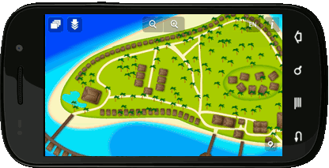
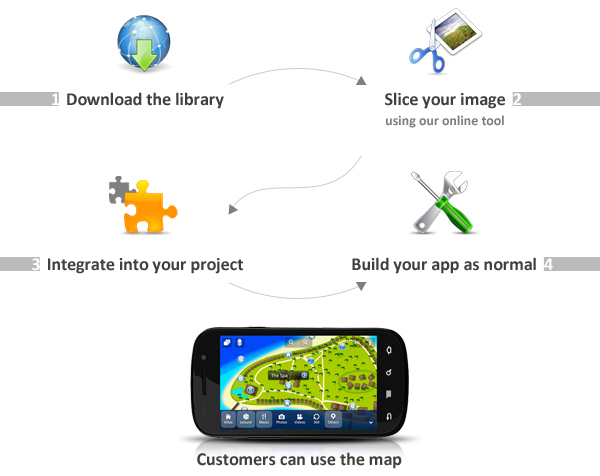

Map services are a major growth area for mobile applications. Services like Google maps have brought map technology to the masses in recent years, but it has been hard to integrate them into applications as Google maps and others require a constant Internet connection and use proprietary resources. This means that if the app has to work offline, use original graphics or other features, a custom map has to be built.

At Lemberg we’ve developed many Android apps with custom maps, and to streamline this process we came up with the mAppWidget code library.

Designed to simplify custom map building, mAppWidget is a powerful tool that significantly cuts time and reduces the cost of the developing offline maps. Now any Android developer can benefit from our experience.

Using apps developed with mAppWidget is possible without data connection, unlike most of the other solutions. mAppWidget also uses a tiling technique for graphics that generates a larger map byre-using smaller images (tiles). This approach saves RAM and increases real-time performance, which is especially important on mobile devices. Zooming into images is not limited by the resolution of the input map image, as beyond the maximum zoom level of the image, the library uses digital zoom.

## Features
* Create map from any image
* Tile engine rendering
* GPS support
* Zoom in/out
* Pinch to zoom gesture
* Zoom on double tap
* Digital zoom
* Pan
* Inertial scroll
* Smooth tiles appearing
* Support of more than one map per application
* Ability to move the map object after it was added to the map
* Add/remove layers
* Add/remove objects
* Click handlers/info bubbles
* Works offline
* External storage support

## Requirements
* Android API 7 or higher
* Android OS 2.1 or higher
* Latest JDK, Android Studio 1.1 is recommended

## Demo app
mAppWidget demo is available for download on Google Play - 
[https://play.google.com/store/apps/details?id=com.ls.mappwidgetdemo](https://play.google.com/store/apps/details?id=com.ls.mappwidgetdemo)

## How to use
Here you can find information on how to use mAppWidget library and FAQ's - 
[http://lemberg.github.io/mappwidget/user_guide.html](http://lemberg.github.io/mappwidget/user_guide.html)

## Proudly brought to you
mAppWidget code library has been developed and open sourced by Lemberg Solutions Android development team. If you are interested in integration or customization of the mAppWidget or looking for any other mobile app development solution please feel free to reach us - [http://lemberg.co.uk](http://lemberg.co.uk).
